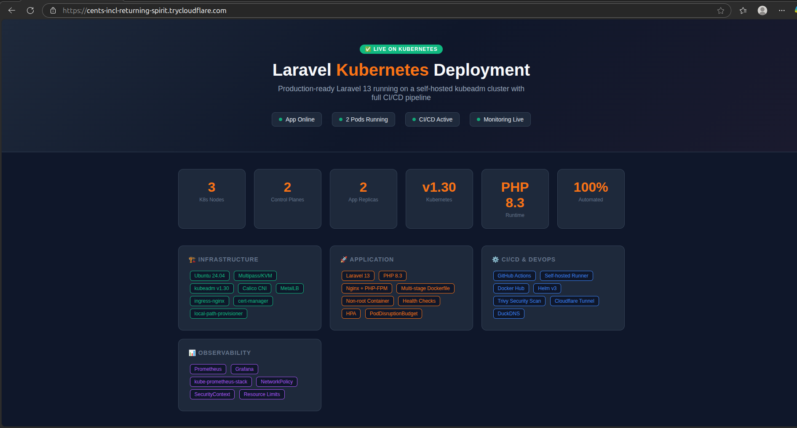
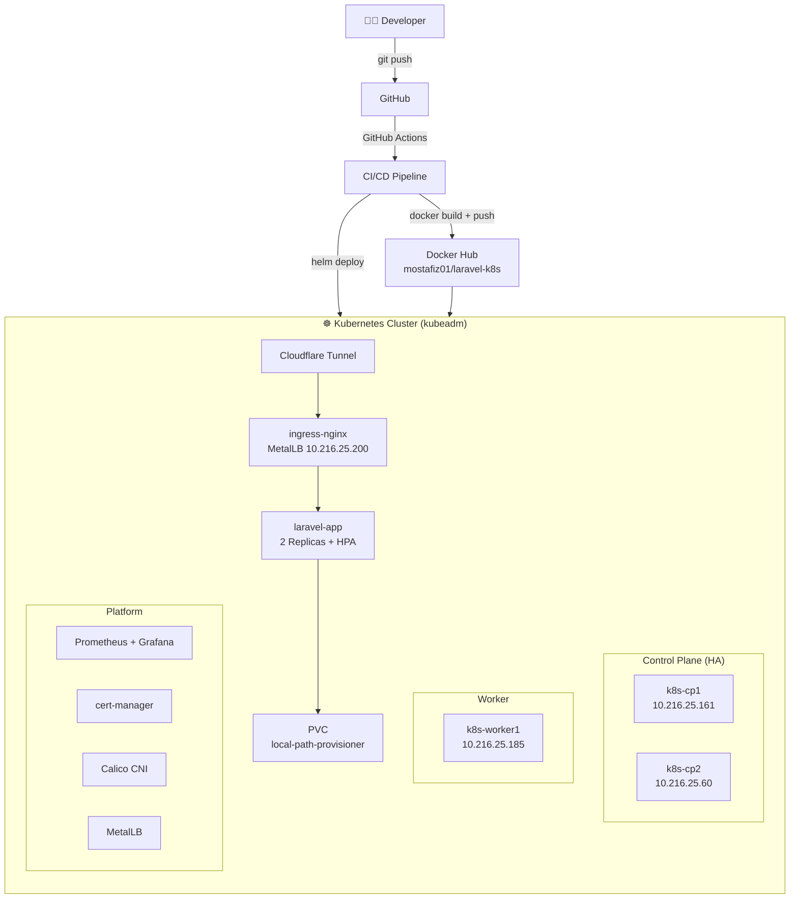
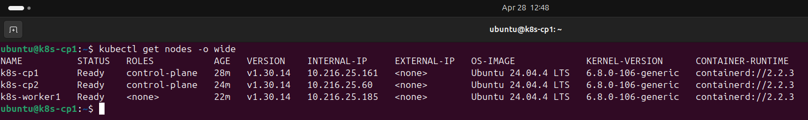
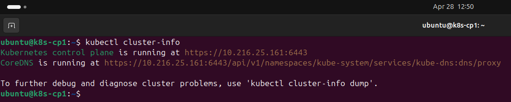
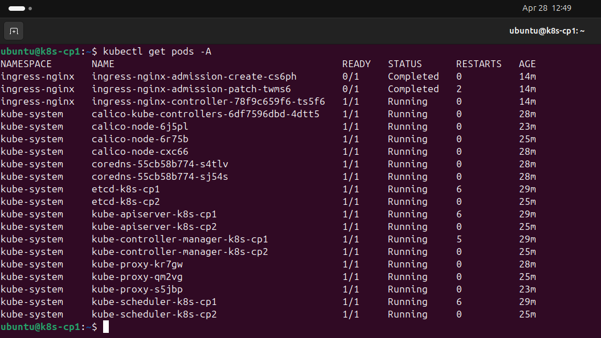
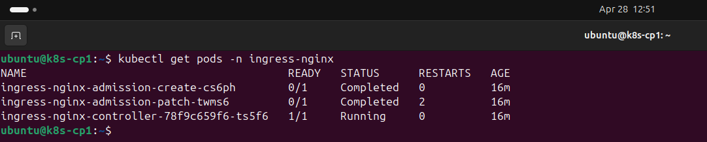
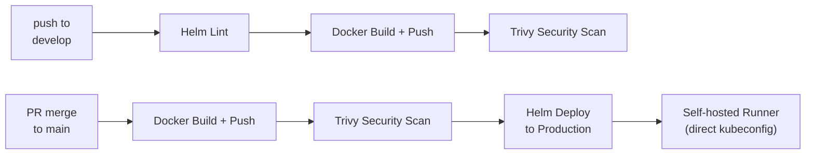
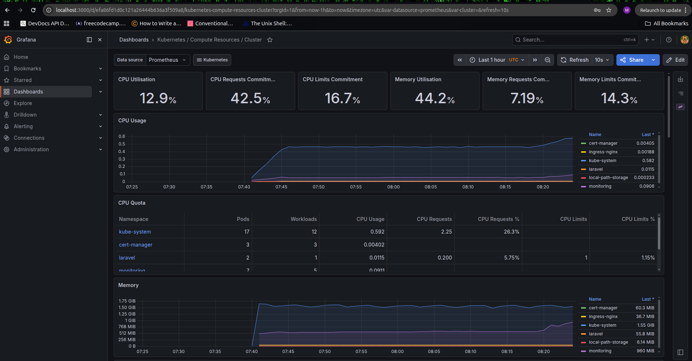

# Laravel Kubernetes Deployment


> Production-ready Laravel application deployed on a **self-managed HA kubeadm Kubernetes cluster** (2 control planes + 1 worker) using Docker, Helm, and GitHub Actions CI/CD. Built from scratch — no managed cloud Kubernetes.

---

## 🌐 Live Demo

| Endpoint | URL |
|---|---|
| Application | https://register-vehicles-process-metric.trycloudflare.com |
| Health Check | https://register-vehicles-process-metric.trycloudflare.com/health |

> All endpoints served via **Cloudflare Tunnel**. URLs may change on host restart (bare-metal constraint).



---

## 🏗️ Architecture



---

## 🖥️ Cluster Specification

| Node | Role | IP | K8s Version |
|---|---|---|---|
| k8s-cp1 | control-plane | 10.216.25.161 | v1.30.14 |
| k8s-cp2 | control-plane | 10.216.25.60 | v1.30.14 |
| k8s-worker1 | worker | 10.216.25.185 | v1.30.14 |



| Component | Version |
|---|---|
| CNI | Calico v3.27.0 |
| Ingress | ingress-nginx v1.10.0 |
| CRI | containerd 2.2.3 |
| StorageClass | local-path-provisioner v0.0.26 |
| LoadBalancer | MetalLB v0.14.3 (pool: 10.216.25.200–220) |
| TLS | cert-manager v1.14.0 (self-signed ClusterIssuer) |
| Monitoring | kube-prometheus-stack (Grafana + Prometheus) |

### Cluster Verification







---

## 📁 Repository Structure

```
laravel-k8s-deployment/
├── app/                          # Laravel application
│   ├── Dockerfile                # Multi-stage production Dockerfile
│   ├── .dockerignore
│   ├── docker/                   # Nginx, PHP-FPM, Supervisor configs
│   └── routes/web.php            # App routes including /health
├── helm/laravel/                 # Helm chart
│   ├── Chart.yaml
│   ├── values.yaml
│   └── templates/
│       ├── deployment.yaml
│       ├── service.yaml
│       ├── ingress.yaml
│       ├── configmap.yaml
│       ├── secret.yaml
│       ├── pvc.yaml
│       ├── namespace.yaml
│       ├── hpa.yaml              # Horizontal Pod Autoscaler
│       ├── pdb.yaml              # Pod Disruption Budget
│       ├── networkpolicy.yaml    # Network isolation
│       └── serviceaccount.yaml
├── .github/
│   ├── actions/setvars/          # Reusable env vars action
│   ├── variables/laravel.env     # Pipeline variables (non-sensitive)
│   └── workflows/
│       ├── deploy-develop.yaml         # Push to develop → lint + build
│       ├── deploy-main.yaml            # PR merge to main → build + deploy
│       ├── callable-docker-push.yaml   # Reusable: build + push + Trivy scan
│       └── callable-helm-deploy.yaml   # Reusable: helm deploy
├── docs/screenshots/             # Cluster verification screenshots
└── README.md
```

---

## 🔄 CI/CD Pipeline



| Branch | Trigger | Actions |
|---|---|---|
| `develop` | Push | Helm lint → Docker build/push → Trivy scan |
| `main` | PR merge | Docker build/push → Trivy scan → Helm deploy |

### Required GitHub Secrets

| Secret | Description |
|---|---|
| `DOCKERHUB_USERNAME` | Docker Hub username |
| `DOCKERHUB_TOKEN` | Docker Hub PAT |
| `APP_KEY` | Laravel APP_KEY |

> `APP_KEY` is passed via `--set` at helm install time and stored in a Kubernetes Secret. It is never committed to the repository.

---

## 🚀 Getting Started

### Prerequisites

- Ubuntu 24.04 host
- `multipass` installed (`sudo snap install multipass`)
- KVM enabled (`sudo modprobe kvm && sudo modprobe kvm_intel`)
- `docker`, `helm v3`, `kubectl` installed

### 1. Launch VMs

```bash
multipass launch --name k8s-cp1    --cpus 2 --memory 3G --disk 20G 24.04
multipass launch --name k8s-cp2    --cpus 2 --memory 3G --disk 20G 24.04
multipass launch --name k8s-worker1 --cpus 2 --memory 4G --disk 20G 24.04
```

### 2. Configure Each Node (run on all 3)

```bash
sudo swapoff -a
sudo modprobe overlay && sudo modprobe br_netfilter

# Install containerd from Docker repo (Ubuntu default is incompatible with kubeadm 1.30)
curl -fsSL https://download.docker.com/linux/ubuntu/gpg | sudo gpg --dearmor -o /etc/apt/keyrings/docker.gpg
echo "deb [arch=amd64 signed-by=/etc/apt/keyrings/docker.gpg] https://download.docker.com/linux/ubuntu noble stable" \
  | sudo tee /etc/apt/sources.list.d/docker.list
sudo apt-get update && sudo apt-get install -y containerd.io
sudo mkdir -p /etc/containerd
containerd config default | sudo tee /etc/containerd/config.toml
sudo sed -i 's/SystemdCgroup = false/SystemdCgroup = true/' /etc/containerd/config.toml
sudo systemctl restart containerd

# Install kubeadm, kubelet, kubectl
curl -fsSL https://pkgs.k8s.io/core:/stable:/v1.30/deb/Release.key \
  | sudo gpg --dearmor -o /etc/apt/keyrings/kubernetes-apt-keyring.gpg
echo 'deb [signed-by=/etc/apt/keyrings/kubernetes-apt-keyring.gpg] https://pkgs.k8s.io/core:/stable:/v1.30/deb/ /' \
  | sudo tee /etc/apt/sources.list.d/kubernetes.list
sudo apt-get update && sudo apt-get install -y kubelet kubeadm kubectl
sudo apt-mark hold kubelet kubeadm kubectl
```

### 3. Initialize Control Plane (cp1 only)

```bash
sudo kubeadm init \
  --control-plane-endpoint "10.216.25.161:6443" \
  --upload-certs \
  --pod-network-cidr=192.168.0.0/16

mkdir -p $HOME/.kube
sudo cp /etc/kubernetes/admin.conf $HOME/.kube/config
kubectl apply -f https://raw.githubusercontent.com/projectcalico/calico/v3.27.0/manifests/calico.yaml
```

### 4. Join cp2 (Control Plane)

```bash
sudo kubeadm join 10.216.25.161:6443 \
  --token <token> \
  --discovery-token-ca-cert-hash sha256:<hash> \
  --control-plane \
  --certificate-key <cert-key>
```

### 5. Join worker1

```bash
sudo kubeadm join 10.216.25.161:6443 \
  --token <token> \
  --discovery-token-ca-cert-hash sha256:<hash>
```

### 6. Install Platform Components

```bash
# ingress-nginx
kubectl apply -f https://raw.githubusercontent.com/kubernetes/ingress-nginx/controller-v1.10.0/deploy/static/provider/baremetal/deploy.yaml

# local-path StorageClass (set as default)
kubectl apply -f https://raw.githubusercontent.com/rancher/local-path-provisioner/v0.0.26/deploy/local-path-storage.yaml
kubectl patch storageclass local-path -p '{"metadata": {"annotations":{"storageclass.kubernetes.io/is-default-class":"true"}}}'
```

---

## 🐳 Docker

```bash
# Build
docker build -t mostafiz01/laravel-k8s:1.0.0 ./app

# Test locally
docker run -d --name laravel-test -p 8080:8080 \
  -e APP_KEY="<your-app-key>" \
  -e APP_ENV=production \
  -e APP_DEBUG=false \
  -e SESSION_DRIVER=file \
  mostafiz01/laravel-k8s:1.0.0

curl http://localhost:8080/
curl http://localhost:8080/health

# Push
docker push mostafiz01/laravel-k8s:1.0.0
```

**Docker Hub:** `docker pull mostafiz01/laravel-k8s:1.0.5`

---

## ⎈ Helm

```bash
# Generate APP_KEY
cd app && php artisan key:generate --show

# Install
helm install laravel ./helm/laravel \
  --set secret.appKey="<APP_KEY>"

# Upgrade
helm upgrade laravel ./helm/laravel \
  --set secret.appKey="<APP_KEY>" \
  --set image.tag="<NEW_TAG>"

# Uninstall
helm uninstall laravel -n laravel
```

---

## ✅ Testing

```bash
# Via MetalLB LoadBalancer IP
curl -H "Host: laravel-test.local" http://10.216.25.200/
curl -H "Host: laravel-test.local" http://10.216.25.200/health

# Via /etc/hosts
echo "10.216.25.200 laravel-test.local" | sudo tee -a /etc/hosts
curl http://laravel-test.local/
curl http://laravel-test.local/health
```

**Expected:**
- `/` → `Laravel Kubernetes Deployment Test`
- `/health` → `OK` (HTTP 200)

---

## 🔒 Secret Management

`APP_KEY` is passed via `--set` at helm install time and stored as a Kubernetes Secret. It is never committed to git or hardcoded in any file.

**Why not Azure Key Vault?** Azure Key Vault requires Azure AD identity and the CSI driver — not available on bare kubeadm without significant additional infrastructure. For a production AKS setup, use Azure Key Vault + CSI driver + Managed Identity or Sealed Secrets / SOPS.

---

## 🛠️ Troubleshooting

<details>
<summary><b>containerd not found after install</b></summary>

Ubuntu's default `containerd` package (2.2.x) is incompatible with kubeadm 1.30. Install `containerd.io` from Docker's official repo instead (see node setup steps above).
</details>

<details>
<summary><b>KVM not available after reboot</b></summary>

```bash
sudo modprobe kvm && sudo modprobe kvm_intel
# Make permanent
echo -e "kvm\nkvm_intel" | sudo tee /etc/modules-load.d/kvm.conf
```
</details>

<details>
<summary><b>VMs have no internet access</b></summary>

```bash
sudo iptables-legacy -t nat -A POSTROUTING -s 10.216.25.0/24 -o wlp0s20f3 -j MASQUERADE
sudo iptables-legacy -A FORWARD -s 10.216.25.0/24 -j ACCEPT
sudo netfilter-persistent save
```
</details>

<details>
<summary><b>Pods not ready — session file error</b></summary>

Laravel tries to write session files to a storage directory overwritten by the PVC mount. The `initContainer` creates the required directory structure before the app starts:

```bash
mkdir -p /var/www/html/storage/framework/{sessions,views,cache}
```
</details>

<details>
<summary><b>PVC stuck in Pending</b></summary>

No default StorageClass on bare kubeadm. Install `local-path-provisioner` and set it as default (see step 6 above).
</details>

---

## 🗺️ Production Improvement Roadmap

| Area | Improvement |
|---|---|
| **Secrets** | Sealed Secrets / SOPS for GitOps-safe storage; Azure Key Vault + CSI on AKS |
| **Database** | External PostgreSQL + Redis for sessions/cache |
| **Infra-as-Code** | Terraform for VM provisioning; Ansible for node config |
| **TLS** | Upgrade cert-manager issuer to Let's Encrypt |
| **Security** | WAF (ModSecurity) at ingress; Pod Security Admission; egress NetworkPolicy per service |
| **Observability** | Sentry for app errors; ELK/Graylog for centralized logs; SLA dashboards |

### Monitoring (Grafana + Prometheus)


| **Deployments** | Blue-green via ingress weight splitting; Vertical Pod Autoscaler |
| **CI/CD** | SonarQube for static analysis; OWASP dependency check; branch protection rules |

---

## 📄 License

MIT